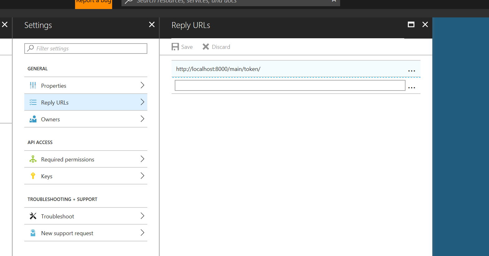
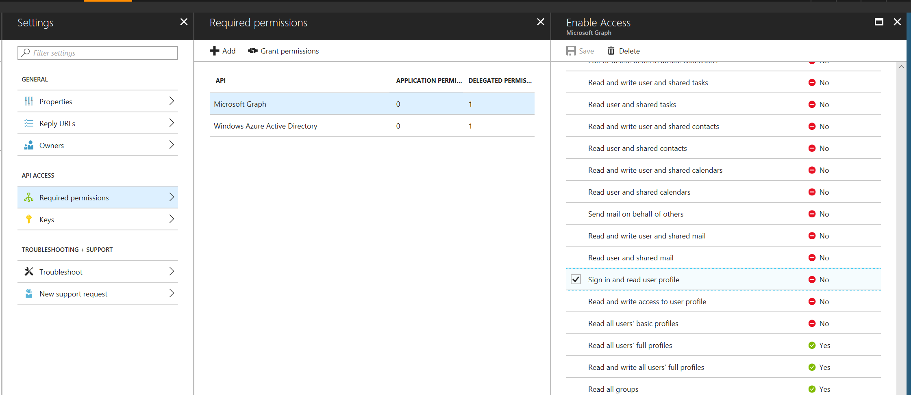

# Django AAD Auth Example

This is an example built from scratch to use django and adal to authenticate into Graph API

## How to configure Azure AD

Create a new Application

Take down the application id and create an application secret.

Inside the Reply URLs



Inside the Required permissions



## How to run this sample

Clone the repository

``` bash
git clone https://github.com/jwendl/django-aad-graph-example.git
```

Change into the aadsite app

``` bash
cd aadsite
```

Edit or create .env to have the right values

``` bash
RESOURCE="https://graph.microsoft.com"
TENANT="microsoft.onmicrosoft.com"
AUTHORITY_HOST_URL="https://login.microsoftonline.com"
CLIENT_ID=""
CLIENT_SECRET=""
API_VERSION="v1.0"
```

> RESOURCE is the resource we are reaching - in this case Graph.
> TENANT is the tenant domain we are connecting to.
> AUTHORITY_HOST_URL is the authority that prooves this exists, usually login.microsoftonline.com.
> CLIENT_ID is the client id from the azure ad portal.
> CLIENT_SECRET is the key created from the azure ad portal.
> API_VERSION is the version of Graph API we want to use.

Fetch requirements

``` bash
sudo pip install -r requirements.txt
```

> Would love to figure out how to do this automatically

Run the application

``` bash
python3 manage.py runserver
```

Then navigate to http://localhost:8000/main/auth

## Steps to use docker

Run the command above to clone from git

Run the following commands

``` bash
docker build -t graph/aad-example:v1 .
docker run -p 8000:8000 graph/aad-example:v1
```